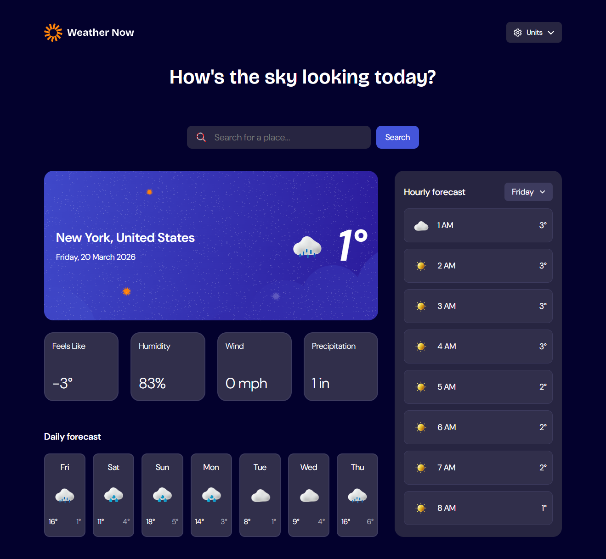

# Frontend Mentor - Weather app solution

This is a solution to the [Weather app challenge on Frontend Mentor](https://www.frontendmentor.io/challenges/weather-app-K1FhddVm49). Frontend Mentor challenges help you improve your coding skills by building realistic projects.

## Table of contents

- [Overview](#overview)
  - [The challenge](#the-challenge)
  - [Screenshot](#screenshot)
  - [Links](#links)
- [My process](#my-process)
  - [Built with](#built-with)
  - [What I learned](#what-i-learned)
  - [Continued development](#continued-development)
  - [Useful resources](#useful-resources)
- [Author](#author)

## Overview

### Users should be able to

---

**Search location and see weather details**

- Search for weather information by entering a location in the search bar

- Dev: Use the open-meteo geolocation API to enable search functionality

- Dev: Display list/s of appeared cities/countries and update it whenever user types on the search bar.

- If user enter/searched invalid inputs:
  - Display "no search result found!" page.

- Else:
  - Display the weather conditions from the specific location entered/selected by the user.

---

**See Current Weather conditions**

- View current weather conditions including temperature, weather icon, and location details.

- See additional weather metrics like "feels like" temperature, humidity percentage, wind speed, and precipitation amounts

---

**See a 7-day weather forecast**

- Browse a 7-day weather forecast with daily high/low temperatures and weather icons

- Dev: Display each weather cards starting from the current day the user is in.

---

**See an hourly forecast**

- View an hourly forecast showing temperature changes throughout the day

- Switch between different days of the week using the day selector in the hourly forecast section

---

**Change the units between imperial and metric measurement**

- Toggle between Imperial and Metric measurement units via the units dropdown

---

**See the web app responsive on desktop and mobile screens**

- View the optimal layout for the interface depending on their device's screen size

---

**See hover and focus states**

- See hover and focus states for all interactive elements on the page

### Screenshot

### Links

- Solution URL: [Github](https://github.com/SoftPillow20/Weather-Now-SPA)
- Live Site URL: [https://weathernow-bern.netlify.app](https://weathernow-bern.netlify.app/)

## My process

### Built with

- Semantic HTML5 markup
- CSS custom properties & CSS modules
- Desktop-first workflow
- [React](https://reactjs.org/) - JS library
- [Vite]
- [react-router-dom]
- [TypeScript] /_Optional_/

### What I learned

I continuously solidify my react skills with this project.

- I've learned how to use typescript and how important it is to have types in my code. Funny enough, when I started learning and writing typescript, it was so hard I had to stop for a week. I did not like how I had to write each and every types for each and every component (which for me defeats the purpose of DRY method). However, after knowing how to use it properly (from trial and error) I've realized how powerful typescript can be. Sometimes, when I'm writing pure react code without typescript, I keep thinking of how nice it would be if it had typescript in it.

- However, not every projects need to be written in typescript, specially not on this one. I realized that maybe a JS doc would suffice than using the entire tool box such as typescript (I only used it for learning purposes).

- Additionally, most of the things I've done with this project has the same way of how I wrote the other project I made (worldwise app).

- However, most of the decisions of how I created this web app was mine, unlike the other app that I use as a reference (that project was made through a code-along course on udemy).

### Continued development

This web app is almost finish, but there is only one functionality missing that is changing the unit from imperial to metric.

I may add some couple animations for each components or weather cards to have it be visually appealing.

## Author

- Frontend Mentor - [@softpillow20](https://www.frontendmentor.io/profile/SoftPillow20)

- Github - [@SoftPillow20](https://github.com/SoftPillow20)
